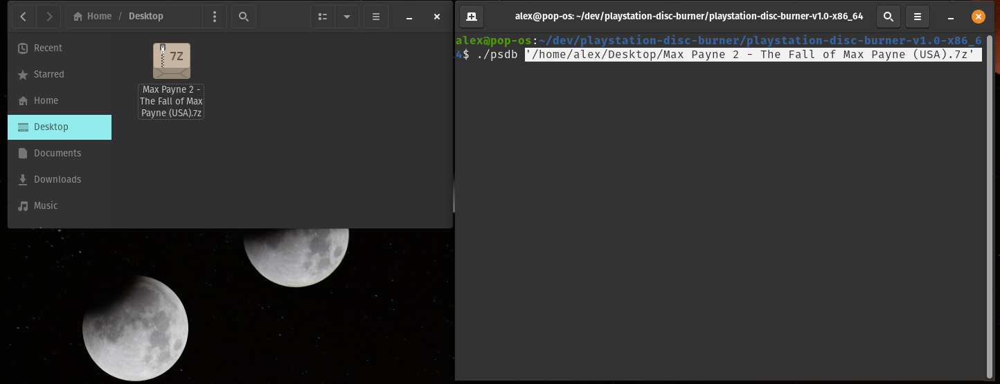
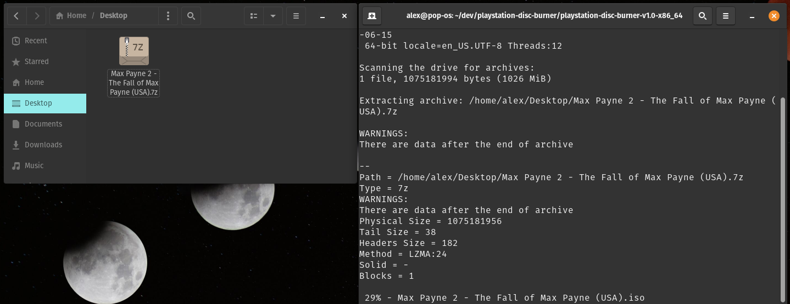
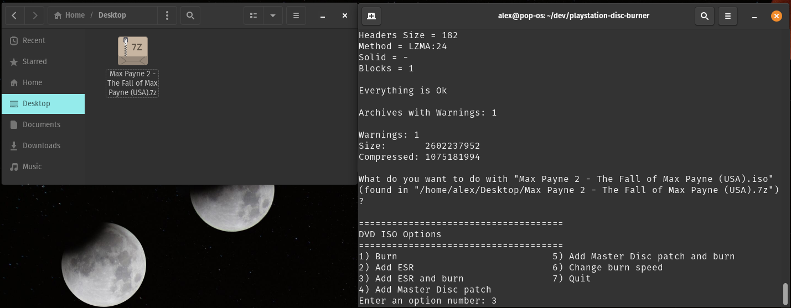
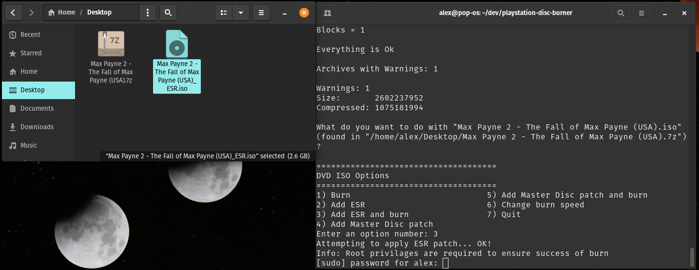
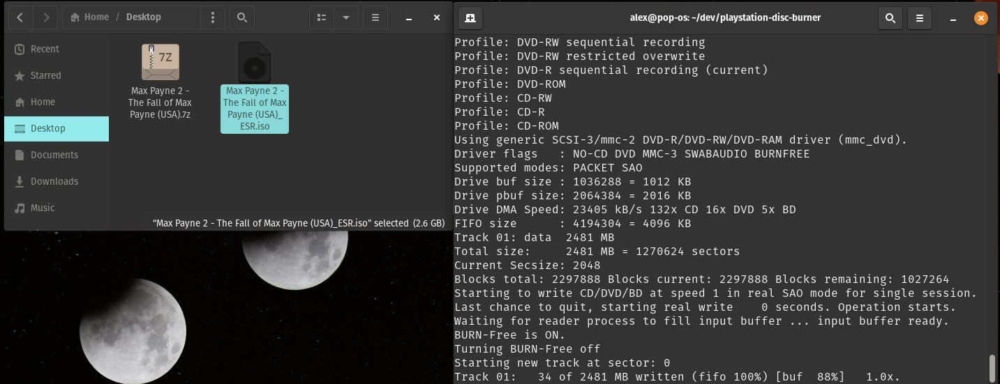
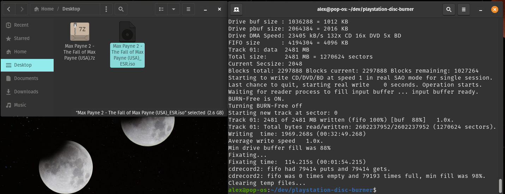

# [PlayStation Disc Burner](readme.md) -> ESR

The PSDB menu options `Add ESR patch` and `Add ESR patch and burn` create a new ESR patched ISO file, sharing the same file name as the original ISO file but with `_ESR` appended to differentiate it. The patcher used is [ESRtool-legacy](https://github.com/ali-raheem/esrtool-legacy).

ESR supports all PlayStation 2 console models, but [compatibility is limited and some games don't work](https://www.psx-place.com/threads/esr-compatibility-lists.33154/). ESR requires burning to a DVD-R, though some PS2 games released on CD-ROM can be converted manually to a UDF DVD ISO and then be ESR patched. To boot ESR patched game on consoles, you need the ESR program on your PS2. The [original versions](https://www.psx-place.com/threads/esr-by-ffgriever.19136/) and [newer ones](https://www.psx-place.com/resources/esr.951/) can be used. With the ESR program, you can now boot the disc by one of the following methods:

*  Turn on `Fast Boot` in FreeMCBoot's configuration options. This allows you to simply have the burned disc boot if it is already in the console when powering it on.

*  Start uLaunchELF/wLaunchELF, put the ESR patched disc in the console, and then start the ESR elf file off a USB flash drive. This can be done entirely with FreeDVDBoot on consoles not compatible with FreeMCBoot, i.e. SCPH-90001.

*   Use FreeMCBoot's `Launch Disc` option in the hacked OSD.

## Example: Max Payne 2 + `Add ESR patch and burn` Option

