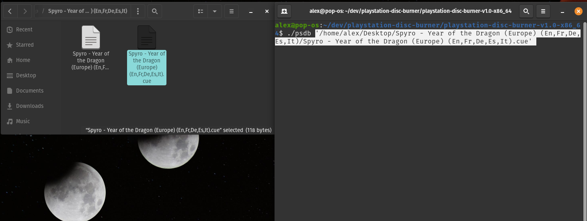
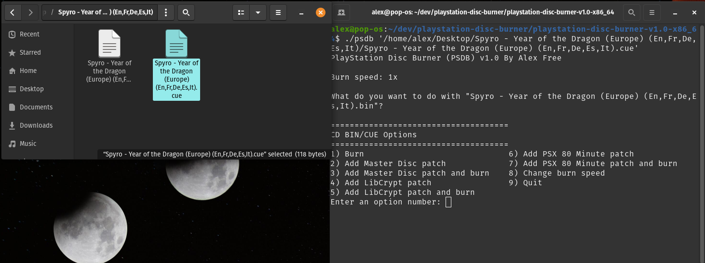
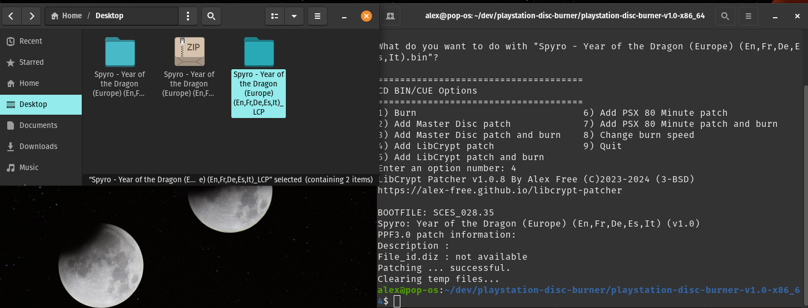

# [PlayStation Disc Burner](readme.md) -> LibCrypt Patch

The PSDB menu options `Add LibCrypt patch` and `Add LibCrypt patch and burn` create a new patched folder of BIN/CUE files, sharing the same name as the input file but with `_LCP` appended. For CD BIN/CUE files found in a compressed archive, a new folder will be created in the same directory as the input file, ending with `_LCP`. If the CD BIN/CUE files are not from a compressed archive, the new directory will instead be created in the parent directory of the original CD image directory, also ending with `_LCP`. The patcher used is [LibCrypt Patcher](https://github.com/alex-free/libcrypt-patcher).

LibCrypt is an additional copy protection found in some PAL region PS1 games that requires special burning software to replicate. LibCrypt patching removes the protection and allows any burning software to correctly burn a working CD-R with the protection removed.

## Example: Spyro: Year Of The Dragon (PS1, Europe) + `Patch LibCrypt` Option

