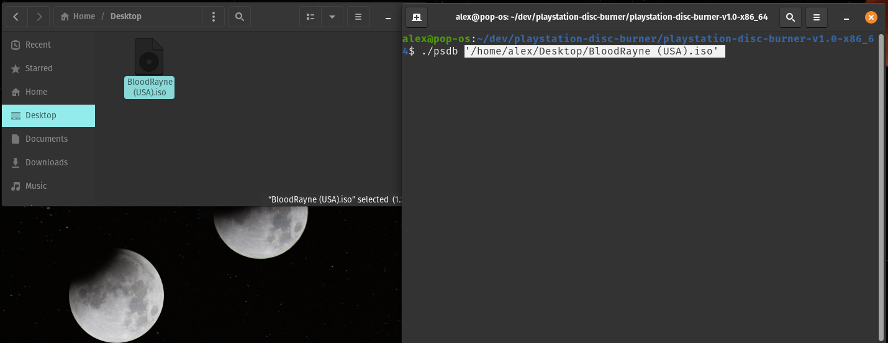
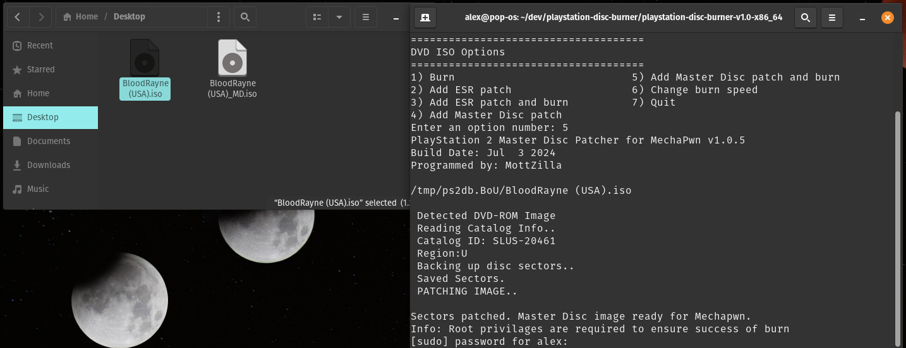
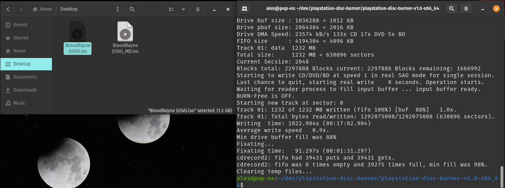
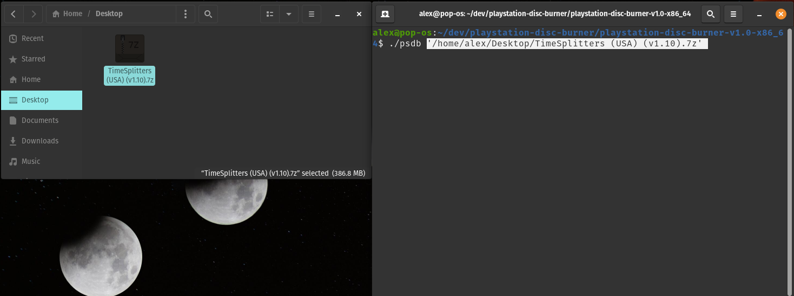
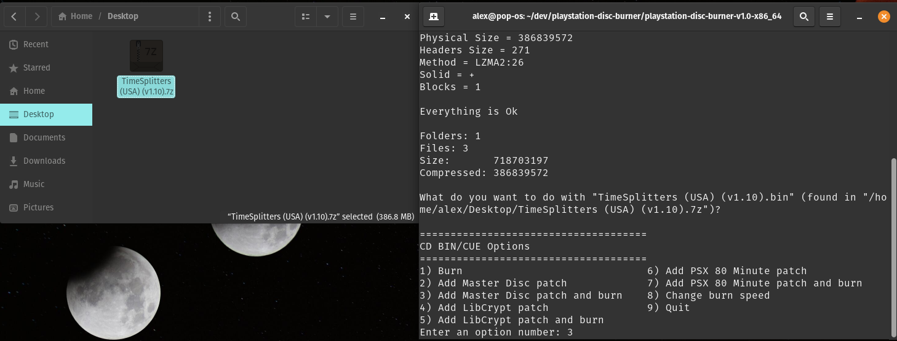
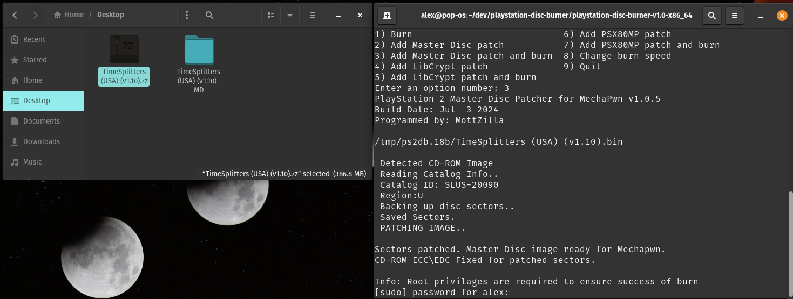
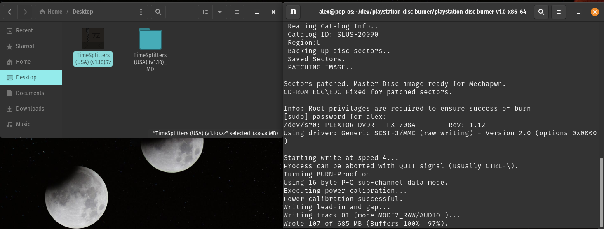
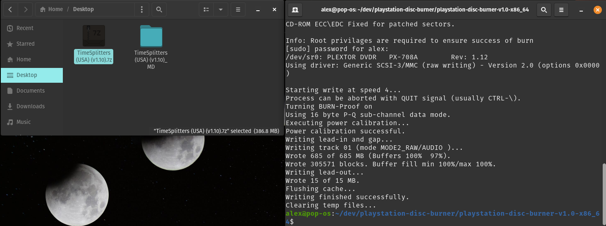

# [PlayStation Disc Burner](readme.md) -> Master Disc Patch

PSDB menu options: `Add Master Disc patch`, `Add Master Disc patch and burn`.

Patcher used: PS2 Master Disc Patcher ([thread](https://www.psx-place.com/threads/playstation-2-master-disc-patcher-for-mechapwn.36547/page-3#post-393254)).

The Master Disc patch enables any PS2 disc image to work on PS2 consoles set to DEX (debug), **which can be done with MechaPwn for any SCPH-50000 or newer PS2 console model.** To boot the game on consoles using MechaPwn this way, you must do one of the following:

*  Boot the game with the uLaunchELF/wLaunchELF `PS2Disc` option (`misc`->`PS2Disc` in menu)

*  Turn on `Fast Boot` in FreeMCBoot's configuration options. This allows you to simply have the burned disc boot if it is already in the console when powering it on.

*   Use FreeMCBoot's `Launch Disc` option.

PS1 Discs do not need to be Master Disc Patched to work on PS2 consoles set to DEX (debug) by MechaPwn, they just boot like real PS1 discs.

If the input was a DVD ISO file a new master disc patched iso will be created in the same directory as the input file ending with `_MD.iso` or `_MD.ISO`. 

If the input was a CD BIN or CUE file a new directory will be created in the same directory as the input file, ending with `_MD` containing the master disc patched version of the CD image.

If a compressed file containing supported input files was the input this option will extract the archive to a folder with the same filename, in the same directory of the compressed archive.

## Example: BloodRayne + `Add Master Disc patch and burn` Option

## Example: TimeSplitters Master Disc Patch And Burn

