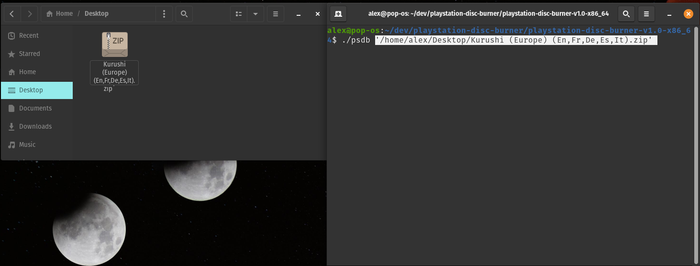
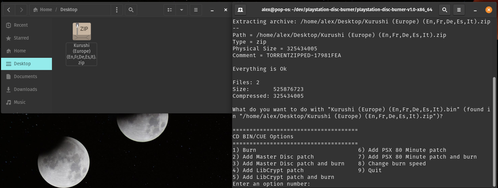
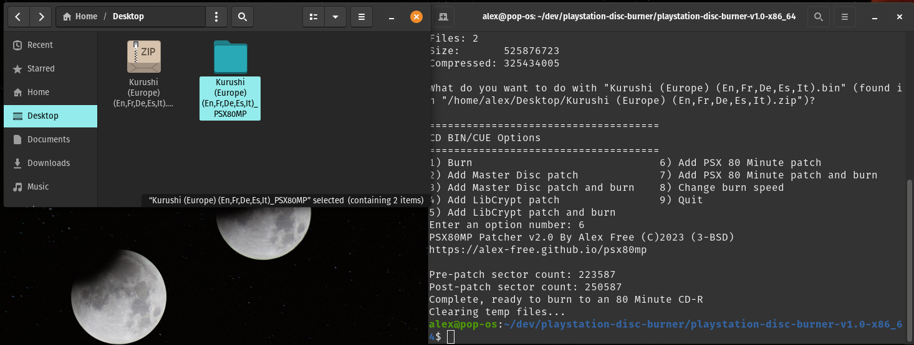

# [PlayStation Disc Burner](readme.md) -> PSX 80 Minute Patch

The PSDB menu options `Add PSX 80 Minute Patch` and `Add PSX 80 Minute Patch and burn` create a new patched folder of BIN/CUE files, sharing the same name as the input file but with `_PSX80MP` appended. For CD BIN/CUE files found in a compressed archive, a new folder will be created in the same directory as the input file, ending with `_PSX80MP`. If the CD BIN/CUE files are not from a compressed archive, the new directory will instead be created in the parent directory of the original CD image directory, also ending with `_PSX80MP`. The patcher used is [PSX80MP](https://github.com/alex-free/psx80mp).

The PSX 80 Minute Patch works around a hardware bug that occurs when reading 80 Minute CD-Rs (disc seek over-run to unburned area causes lock up of optical drive) on early models of PS2 (SCPH-10000 - SCPH-390004). It does this by adding dummy data, appended to the end of the disc image. This prevents PS1 and PS2 (CD) games from triggering the hardware bug. This patch is useful for affected PS2 console models with either a mod-chip or a soft-mod.

[Tonyhax International](https://github.com/alex-free/tonyhax) has a work-around for this problem it uses when booting PS1 discs on affected PS2 consoles. It allows booting games burned to 80 Minute CD-Rs with no patching requirement, but can not guarantee the game itself won't trigger the same hardware bug during game play (though that hasn't actually happened yet to my knowledge). The PSX80MP patch does.

## Example: Kurushi (PS1, Europe) + `Add PSX 80 Minute patch` Option

