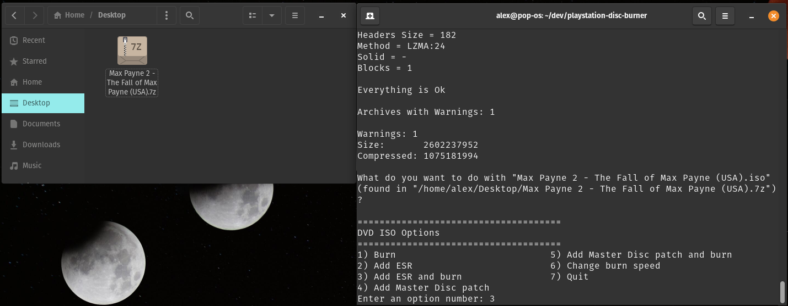
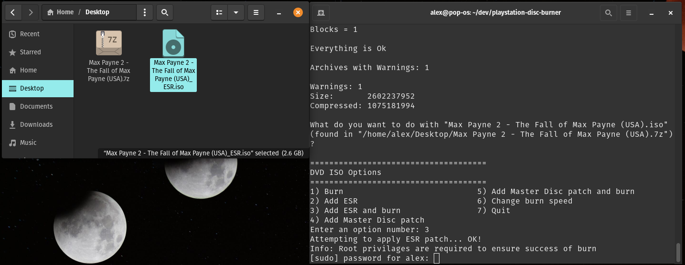
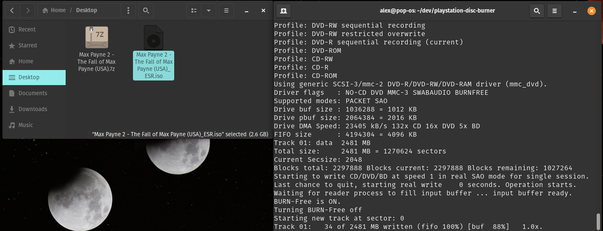
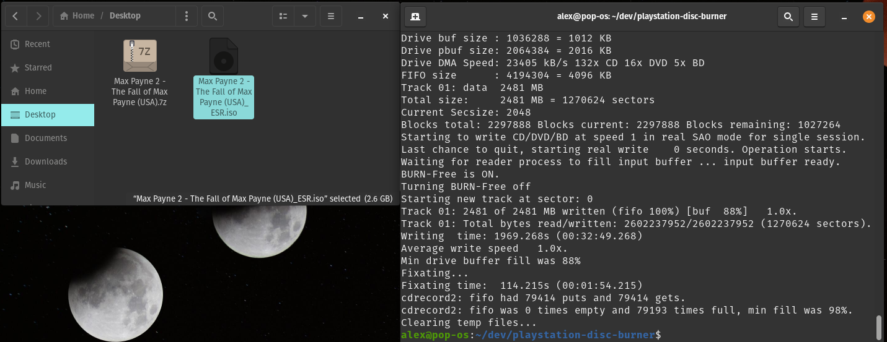
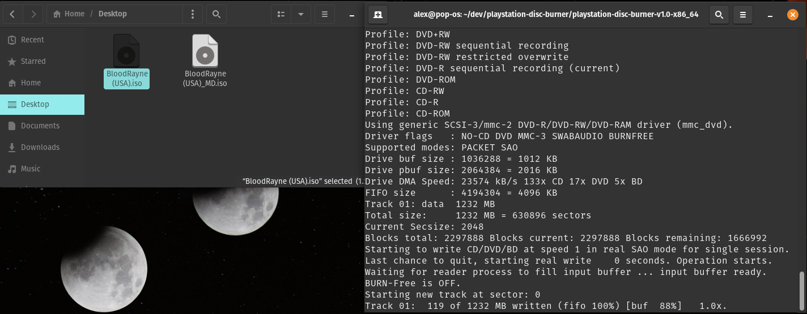
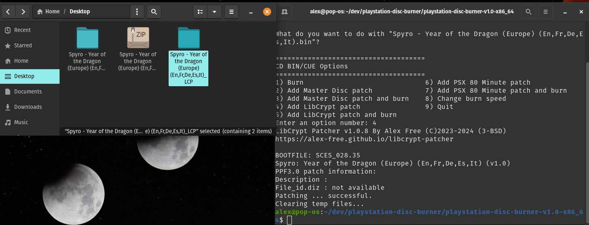

# PlayStation Disc Burner (PSDB) : Patch + Burn PS2 And PS1 Discs On Linux

_by Alex Free_

This is an open source portable tool kit that allows you to burn PS2 and PS1 backup discs on Linux, with the option of patching the disc image in various ways:

* [ESR patch](#esr) PS2 games, and burn them to DVD-R.

* [Master Disc patch](#master-disc) PS2 games, and burn them to CD-R or DVD-R.

* [LibCrypt patch](#libcrypt) PS1 games, and burn them to a CD-R.

* [PSX 80 Minute patch](#psx80mp) PS1 or PS2 games, and burn them to a CD-R.

* [PSX Undither patch](#psx-undither) PS1 games, and burn them to a CD-R.

Additional features:

* Burn PS2 and PS1 games to CD-R or DVD-R without applying one of the above patches. 

* Portable Linux releases.

* Support for compressed files. If PSDB finds a file ending in `.iso`, `.ISO`, `.cue`, `.CUE`, `.bin`, `.BIN`, `.vcd`, or `.VCD` in a compressed archive format that p7zip supports it will automatically be extracted and configured for all features.

* Correctly burns EDC protected PS1 games, by corrects EDC and ECC starting at the system volume descriptor of the data track for CD images. This simultaniously ensures mods/hacks/translations that contain invalid EDC/ECC data can be burned in RAW writing mode, and games with EDC based protection still work. See the [Raw Writing](#raw-writing) section.

* Set the desired burn speed to a configuration file, this can be set for different speeds depending on if your burning a CD or a DVD.

* Set the desired burner (i.e. `/dev/sr0` is the default for Linux) to a configuration file.

| [GitHub](https://github.com/alex-free/playstation-disc-burner) | [Homepage](https://alex-free.github.io/psdb) | [PSX-Place Thread](https://www.psx-place.com/threads/psdb-patch-esr-master-disc-psx80mp-libcrypt-etc-burn-ps2-and-ps1-discs.44156) | [GBATemp Thread](https://gbatemp.net/threads/playstation-disc-burner-psdb-patch-esr-master-disc-psx80mp-libcrypt-etc-burn-ps2-and-ps1-discs.658102) |

## Table Of Contents

* [Downloads](#downloads)
* [Usage](#usage)
* [Patches](#patches)
* [RAW Writing](#raw-writing)
* [Building From Source](build.md)
* [License](#license)

## Downloads

### v1.0.5 (10/31/2025)

*   [playstation-disc-burner-v1.0.5-x86\_64](https://github.com/alex-free/playstation-disc-burner/releases/download/v1.0.5/playstation-disc-burner-v1.0.5-x86_64.zip) _Portable Release For x86\_64 Linux_.

---------------------------

Changes:

* Now can burn VCD files!

* RAW burning toggle now enabled for all CD related burn/patch options.

* EDC/ECC now corrected starting at the volume descriptor sector for all CD burning options in RAW writing mode.

* Added support for [PSX Undither](https://github.com/alex-free/psx-undither) patching and burning.

* Displays output directory of patched file when done.

* Improved build script.

* Improved readme.

* Now licensed under the 3-BSD license.

[Previous versions](changelog.md)

## Usage

```
psdb <input file>

<input file>     A file ending in .iso, .ISO, .cue, .CUE, .bin, .BIN, .VCD, .vcd (or a compressed archive containing said files).

psdb -cds <cd burn speed>      Set burn speed for CDs to <cd burn speed> and exit.

psdb -dvds <dvd burn speed>      Set burn speed to <dvd burn speed> for DVDs and exit.

psdb -b <burner>      Set burner to <burner> (i.e. "/dev/sr0").

psdb -r <yes/no>      Enable RAW writing (not compatibile with some burners, default is no).
```

1) Download and unzip the latest release.

2) Execute `psdb` with one argument, the input file.

`./psdb <input file>`

You can also drag and drop a disc image onto the `ps2db` file in the release if your Linux desktop environment supports it. Otherwise you can drag `psdb` into your terminal and then the input file into your terminal and press return.

`<input file>` can be:

* A PS1 or PS2 CD image BIN file with the extension `.bin` or `.BIN`.
* A PS1 or PS2 CD image CUE file with the extension `.cue` or `.CUE`.
* A PS1 VCD (POPS) image file with the extension `.vcd` or `.VCD`.
* A PS2 DVD image ISO file with the extension `.iso` or `.ISO`.
* A compressed archive containing any of the files above.

3) Enter option number for desired feature. PSDB will detect what type of file the disc image is and present you with options for either CD-Rs or DVD-Rs depending on the disc image.


Note: You will be prompted for root privileges when the burning program is executed in order to prevent buffer under-runs during burning which would result in a coaster. Root privileges also ensure that the burning program can access your burner hardware successfully.

## Patches

* [ESR](#esr).

* [Master Disc](#master-disc).

* [LibCrypt](#libcrypt).

* [PSX 80 Minute Patch](#psx80mp).

* [PSX Undither](#psx-undither).

### ESR

ESR supports all PlayStation 2 console models, but [compatibility is limited and some games don't work](https://www.psx-place.com/threads/esr-compatibility-lists.33154/). ESR requires burning to a DVD-R, though some PS2 games released on CD-ROM can be converted manually to a UDF DVD ISO and then be ESR patched. To boot ESR patched game on consoles, you need the ESR program on your PS2. The [original versions](https://www.psx-place.com/threads/esr-by-ffgriever.19136/) and [newer ones](https://www.psx-place.com/resources/esr.951/) can be used. With the ESR program, you can now boot the disc by one of the following methods:

* Turn on `Fast Boot` in FreeMCBoot's configuration options. This allows you to simply have the burned disc boot if it is already in the console when powering it on.

* Start uLaunchELF/wLaunchELF, put the ESR patched disc in the console, and then start the ESR elf file off a USB flash drive. This can be done entirely with FreeDVDBoot on consoles not compatible with FreeMCBoot, i.e. SCPH-90001.

* Use FreeMCBoot's `Launch Disc` option in the hacked OSD.

Example: Max Payne 2 + `Add ESR patch and burn` option:










[ESR Tool Legacy website](https://github.com/ali-raheem/esrtool-legacy).

### Master Disc

Master Disc patched PS2 disc images when burned to a CD-R or DVD-R read like real games on PS2 consoles set to DEX, **which can be done with MechaPwn for any SCPH-50000 or newer PS2 console model.** To boot Master Disc patched PS2 game on consoles set to DEX with MechaPwn

* Boot the game with the uLaunchELF/wLaunchELF `PS2Disc` option (`misc`->`PS2Disc` in menu)

* Turn on `Fast Boot` in FreeMCBoot's configuration options. This allows you to simply have the burned disc boot if it is already in the console when powering it on.

* Use FreeMCBoot's `Launch Disc` option.

PS1 Discs do not need to be Master Disc Patched to work on PS2 consoles set to DEX, they simply boot like real PS1 discs. 

Example: BloodRayne + `Add Master Disc patch and burn` Option





Example: TimeSplitters Master Disc Patch And Burn


[PS2 Master Disc Patcher website](https://www.psx-place.com/threads/playstation-2-master-disc-patcher-for-mechapwn.36547/page-3#post-393254).

### LibCrypt

LibCrypt is an additional copy protection found in some PAL region PS1 games that requires special burning software to replicate. LibCrypt patching removes the protection and allows any burning software to correctly burn a working CD-R with the protection removed.

Example: Spyro: Year Of The Dragon (PS1, Europe) + `Patch LibCrypt` option:




[LibCrypt Patcher website](https://github.com/alex-free/libcrypt-patcher).

### PSX80MP

The PSX 80 Minute Patch works around a hardware bug that occurs when reading 80 Minute CD-Rs (disc seek over-run to unburned area causes lock up of optical drive). It does this by adding dummy data, appended to the end of the disc image. This prevents PS1 and PS2 (CD) games from triggering the hardware bug. This patch is useful for affected PS2 console models with either a mod-chip or a soft-mod.

[Tonyhax International](https://github.com/alex-free/tonyhax) has a work-around for this problem it uses when booting PS1 discs on affected PS2 consoles. It allows booting games burned to 80 Minute CD-Rs with no patching requirement, but can not guarantee the game itself won't trigger the same hardware bug during game play (though that hasn't actually happened yet to my knowledge). The PSX80MP patch does.

Example: Kurushi (PS1, Europe) + `Add PSX 80 Minute patch` option:


[PSX80MP Website](https://github.com/alex-free/psx80mp).

### PSX Undither

Patch PlayStation 1 games to turn off the dithering effect by either modifying the CD image directly, or generating GameShark codes from a DuckStation RAM dump.

Dithering is a graphical effect that exploit the blur of a CRT set in combination with a composite signal in order to create transparency or texture related detail/color illusion effects. Most PS1 games were explicitly designed with the expected setup of a CRT TV using a composite signal (be that S-Video or standard AV RCA cables) in mind. Some games even heavily depend on dithering (i.e. Silent Hill) to hide color banding.

PS1 Console models with the original dual-ported VRAM GPU (SCPH-1000, early SCPH-1001, early SCPH-1002, and early SCPH-3000) have a less advanced dithering capability then ones with the newer SGRAM GPU. This may make disabling of dithering cause less of a visual change on these older console models with the original GPU design, according to no Martin Korth of No $ fame.

Without a CRT TV dithering can make some games appear less sharp and nosier (an opinion shared by many, but not a fact), causing a non-intentional checkerboard pattern on textures and or a noticeable drop in clarity on TV's using Plasma, LCD, OLED, or similar non-CRT-based screen technologies. Dithering is usually lost in translation when using emulators (varies from emulator to emulator), however one way to see it is to use DuckStation with the software renderer:

Dither ON (DuckStation Software Renderer):


([Full Screen Image](https://raw.githubusercontent.com/alex-free/playstation-disc-burner/master/images/tekken-3-dither-on.png))

Dither OFF (DuckStation Software Renderer):


([Full Screen Image](https://raw.githubusercontent.com/alex-free/playstation-disc-burner/master/images/tekken-3-dither-off.png))

Note: the floor, the background, the character models.

For more info on PS1 dithering, please see [ConsoleMods Wiki: PS1 De-dithering Patch](https://consolemods.org/wiki/PS1:De-dithering_Patch) and [PlayStation 1 Dithering Removal - by Chris Covell](https://www.chrismcovell.com/psxdither.html). The latter contains **great side by side comparison images** and further technical information. There are also comparisons on YouTube.

[PSX Undither website](https://github.com/alex-free/psx-undither).

## Raw Writing

A [small](https://github.com/alex-free/tonyhax/blob/master/anti-piracy-bypass.md#edc) number of PSX games require RAW burning due to EDC/ECC based protection (this does not affect Libcrypt patcher). Please see if your game is affected by finding it in [this table](https://github.com/alex-free/tonyhax/blob/master/anti-piracy-bypass.md) (`CTRL+F` is your friend here).

If your game is affected, you can enable raw burning by using `psdb -r yes`. This is not enabled by default because some burners are not able to write in raw mode. If you find that your burner can not write in raw mode (cdrdao will give you an error) you can change it back to non-raw by using `psdb -r no`.

## License

PSDB itself is released under the 3-BSD license, see the file `licenses/psdb.md`. PSDB makes use of the following programs listed below, which have their own licenses/terms:

* [PortableLinuxExecutableDirectory](https://alex-free.github.io/pled) (Public Domain, see the file `licenses/pled.md`).

* [EDCRE](https://github.com/alex-free/edcre) (GNU GPL v2, see the file `licenses/edcre.md`.).

* [CDRTools-PLED](https://github.com/alex-free/cdrtools-pled) (CDDL v1.0 AND GPL v2, see the files `licenses/cdrecord-cddl.md` and `licenses/cdrecord-gpl2.md`).

* [CDRDAO-PLED](https://github.com/alex-free/cdrdao-pled) (GPL v2, see the file `licenses/cdrdao.md`).

* [PSX80MP](https://github.com/alex-free/psx80mo) (3-BSD, see the file `licenses/psx80mp.md`).

* [LibCrypt Patcher](https://github.com/alex-free/psx80mo) (3-BSD, see the file `licenses/libcrypt-patcher.md`).

* [PSX Undither](https://github.com/alex-free/psx-undither) (GPL v2, see the file `licenses/psx-undither.md`).

* [ESRTool-legacy](https://github.com/ali-raheem/esrtool-legacy) (GPL v2, see the file `licenses/esrtool-legacy.md`).

* [PSX Undither](https://github.com/ali-raheem/esrtool-legacy) (GPL v2, see the file `licenses/psx-undither.md`).

* [PS2 Master Disc Patcher](https://www.psx-place.com/threads/playstation-2-master-disc-patcher-for-mechapwn.36547/page-3#post-393254) (by MottZilla, closed source currently).

* [P7zip-zstd](https://github.com/p7zip-project/p7zip) (GNU LGPL with unRAR license restriction, BSD-3 Clause, and Public Domain), see `licenses/p7zip.md`.

* [POPS2CUE](https://github.com/bucanero/pops2cue) (GPL v3, see the file `licenses/pops2cue.md`).
