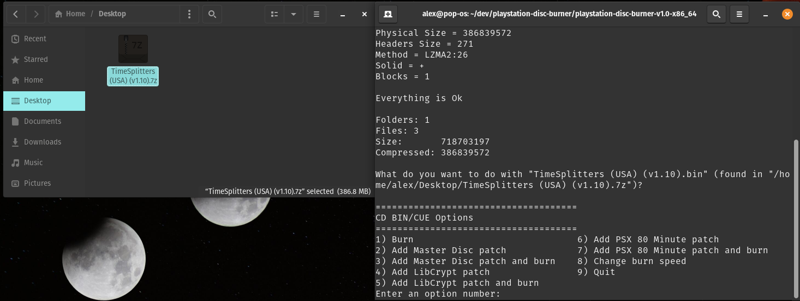

# PlayStation Disc Burner (PSDB) : Patch + Burn PS2 And PS1 Discs On Linux

_by Alex Free_

This is an open source tool kit that allows you to burn PS2 and PS1 backup discs on Linux, with the option of patching the disc image in various ways:

*   [ESR patch](esr.md) PS2 games, and burn them to DVD-R.

*   [Master Disc patch](master-disc.md) PS2 games, and burn them to CD-R or DVD-R.

*   [LibCrypt patch](libcrypt.md) PS1 games, and burn them to a CD-R.

*   [PSX 80 Minute patch](psx80mp.md) PS1 or PS2 games, and burn them to a CD-R.

Additional features:

*   Burn PS2 and PS1 games to CD-R or DVD-R without applying one of the above patches. 

*   Portable Linux releases for i686 and x86_64.

*   Support for compressed files. If PSDB finds a file ending in `.iso`, `.ISO`, `.cue`, `.CUE`, `.BIN`, or `.bin` in a compressed archive format that p7zip supports it will automatically be extracted and configured for all features.

*   Correctly burns EDC protected PS1 games.

*   Corrects EDC and ECC starting at the system volume descriptor of the data track for CD images. Any translation patched bin file or otherwise which doesn't contain correct EDC/ECC in the actual game data will be corrected. EDC protected PS1 games continue to burn correctly with this default, as those games are looking at sectors that are before the volume descriptor.

*   Set the desired burn speed to a configuration file, this can be set for different speeds depending on if your burning a CD or a DVD.

*   Set the desired burner (i.e. `/dev/sr0` is the default for Linux) to a configuration file.

| [GitHub](https://github.com/alex-free/playstation-disc-burner) | [Homepage](https://alex-free.github.io/psdb) | [PSX-Place Thread](https://www.psx-place.com/threads/psdb-patch-esr-master-disc-psx80mp-libcrypt-etc-burn-ps2-and-ps1-discs.44156) | [GBATemp Thread](https://gbatemp.net/threads/playstation-disc-burner-psdb-patch-esr-master-disc-psx80mp-libcrypt-etc-burn-ps2-and-ps1-discs.658102) |

## Table Of Contents

* [Downloads](#downloads)
* [Usage](#usage)
* [RAW Writing](#raw-writing)
* [Building From Source](build.md)
* [License](#license)

## Downloads

### v1.0.4 (9/27/2025)

*   [playstation-disc-burner-v1.0.4-x86\_64](https://github.com/alex-free/playstation-disc-burner/releases/download/v1.0.4/playstation-disc-burner-v1.0.4-x86_64.zip) _Portable Release For x86\_64 Linux_.

---------------------------

Changes:

* Updated [EDCRE](https://github.com/alex-free/edcre) to version 1.1.0.

* Updated [Libcrypt Patcher](https://github.com/alex-free/libcrypt-patcher) to version 1.0.9.

* Updated [PS2 Master Disc Patcher](https://www.psx-place.com/threads/playstation-2-master-disc-patcher-for-mechapwn.36547/page-3#post-409346) to v1.0.6.

* Updated [P7zip-zstd](https://github.com/p7zip-project/p7zip) to git commit 6819e2dc1917e1267babddc6391cea56ead7123d.

* Implemented fixes for an issue where if you [symlink](https://github.com/alex-free/playstation-disc-burner/pull/2) `psdb` to i.e. `/usr/local/bin/psdb` thanks to [brkzlr](https://github.com/brkzlr). Since it had been over a year and I had more plans on how to re-archeticutre the current `psdb` to work under such conditions, I took inspirations/code changes from his original pull request and re-integrated it into the v1.0.4 source tree. But they did point out this issue first and provided fixes which I built upon on v1.0.4 nearly a year later so many thanks to them.

* New default burning mode is **non-RAW**. This change has happened because [_many_](https://gbatemp.net/threads/do-modern-burners-cds-make-lower-quality-ps1-backups.628708/page-12#post-10710761) burners do not support RAW burning mode, and only a [small](https://github.com/alex-free/tonyhax/blob/master/anti-piracy-bypass.md#edc) amount of PSX games require it. **The RAW burning mode can be enabled by specifying `psdb -r yes` to burn such games. I recommend to do this if your burner works with RAW mode. If you have issues burning discs in RAW mode, you can specify `pdsb -r no` to disable RAW mode.**

* Changed how to specify a custom burner config. Instead of i.e. `psdb -burner /dev/sr1`, do `psdb -b /dev/sr1`. This is still an "advanced" feature and `psdb` will find the default burner by default in almost all cases (which is normally `/dev/sr0`).

* Re-compiled the portable build. This fixes [issues](https://github.com/alex-free/playstation-disc-burner/issues/7#issue-3348980745) with Linux distros using GLIB 2.34 which can't load the included STATIC ld loader. Really strange why this ever became an issue.

* Mandated GCC/G++ 13 be used for compilation since cdrtools is broken on GCC 14+.

* Improved build system.

[Previous versions](changelog.md)

## Usage

`psdb <input file>`

`<input file>     A file ending in .iso, .ISO, .cue, .CUE, .BIN, or .bin (or a compressed archive containing said files).`

`psdb -cds <cd burn speed>      Set burn speed for CDs to <cd burn speed> and exit.`

`psdb -dvds <dvd burn speed>      Set burn speed to <dvd burn speed> for DVDs and exit.`

`psdb -b <burner>      Set burner to <burner> (i.e. "/dev/sr1").`

`psdb -r <yes/no>      Enable RAW writing (not compatibile with some burners, default is no).`

1) Download and unzip the latest release.

2) Execute `psdb` with one argument, the input file.

`./psdb <input file>`

You can also drag and drop a disc image onto the `ps2db` file in the release if your Linux desktop environment supports it. Otherwise you can drag `psdb` into your terminal and then the input file into your terminal and press return.

`<input file>` can be:

*   A PS1 or PS2 CD image BIN file with the extension `.bin` or `.BIN`.
*   A PS1 or PS2 CD image CUE file with the extension `.cue` or `.CUE`.
*   A PS2 DVD image ISO file with the extension `.iso` or `.ISO`.
*   A compressed archive containing any of the files above.

3) Enter option number for desired feature. PSDB will detect what type of file the disc image is and present you with options for either CD-Rs or DVD-Rs depending on the disc image.

Note: You will be prompted for root privileges when the burning program is executed in order to prevent buffer under-runs during burning which would result in a coaster. Root privileges also ensure that the burning program can access your burner hardware successfully.

## Raw Writing

A [small](https://github.com/alex-free/tonyhax/blob/master/anti-piracy-bypass.md#edc) number of PSX games require RAW burning due to EDC/ECC based protection (this does not affect Libcrypt patcher). Please see if your game is affected by finding it in [this table](https://github.com/alex-free/tonyhax/blob/master/anti-piracy-bypass.md) (`CTRL+F` is your friend here).

If your game is affected, you can enable raw burning by using `psdb -r yes`. This is not enabled by default because some burners are not able to write in raw mode. If you find that your burner can not write in raw mode (cdrdao will give you an error) you can change it back to non-raw by using `psdb -r no`.

## License

PSDB itself is released into the public domain, see the file `licenses/psdb.md`.

PSDB makes use of the following programs listed below, which have their own licenses/terms:

*   [PortableLinuxExecutableDirectory](https://alex-free.github.io/pled) (Public Domain, see the file `licenses/pled.md`).

*   [EDCRE](https://github.com/alex-free/edcre) (GNU GPL v2, see the file `licenses/edcre.md`.).

*   [CDRTools-PLED](https://github.com/alex-free/cdrtools-pled) (CDDL v1.0 AND GPL v2, see the files `licenses/cdrecord-cddl.md` and `licenses/cdrecord-gpl2.md`).

*   [CDRDAO-PLED](https://github.com/alex-free/cdrdao-pled) (GPL v2, see the file `licenses/cdrdao.md`).

*   [PSX80MP](https://github.com/alex-free/psx80mo) (3-BSD, see the file `licenses/psx80mp.md`).

*   [LibCrypt Patcher](https://github.com/alex-free/psx80mo) (3-BSD, see the file `licenses/libcrypt-patcher.md`).

*   [ESRTool-legacy](https://github.com/ali-raheem/esrtool-legacy) (GPL v2, see the file `licenses/esrtool-legacy.md`).

*   [PS2 Master Disc Patcher](https://www.psx-place.com/threads/playstation-2-master-disc-patcher-for-mechapwn.36547/page-3#post-393254) (by MottZilla, closed source currently).

*   [P7zip-zstd](https://github.com/p7zip-project/p7zip) (GNU LGPL with unRAR license restriction, BSD-3 Clause, and Public Domain), see `licenses/p7zip.md`.